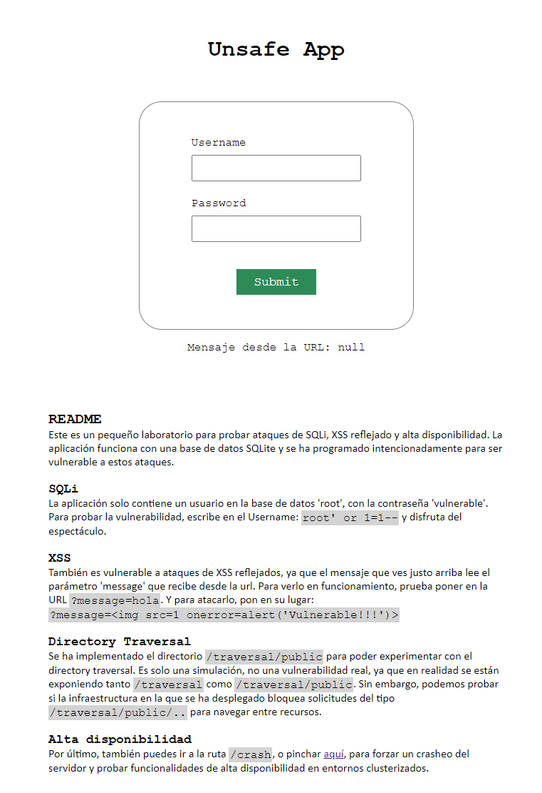

# Laboratorio básico de hacking web

Este es un laboratorio escrito en el lenguaje GO realiza expresamente para ser vulnerable a varias amenazas, como SQLi y XSS. Además está pensado para probar la seguridad de la infraestructura donde se despliega, ya que cuenta con un endpoint `/crash`, que provoca un fallo forzado del servidor que hace que se caiga. Esto es útil para probar implementaciones de alta disponibilidad con kubernetes, por ejemplo. También cuenta con un enpoint especial `/traversal/public` al cual se le puede hacer un directory traversal `/traversal/public/..` y probar si el WAF de la infraestructrua bloquea la petición o no.

## Despliegue y pruebas

Puedes ejecutar el servidor directamente en tu máquina si tienes go instalado (este ejemplo se ha hecho con la versión `1.22.1`).

```bash
go run .\server.go
```

También tienes la opción de dockerizar la aplicación y ejecutarla como un contenedor.

```bash
docker build -t vulnerable:v1 .
docker container run --name vulnerable -dp 3100:3100 vulnerable:v1
```

En cualquier caso, puedes acceder a través de la url `http://localhost:3100`.

## Cómo se ve


